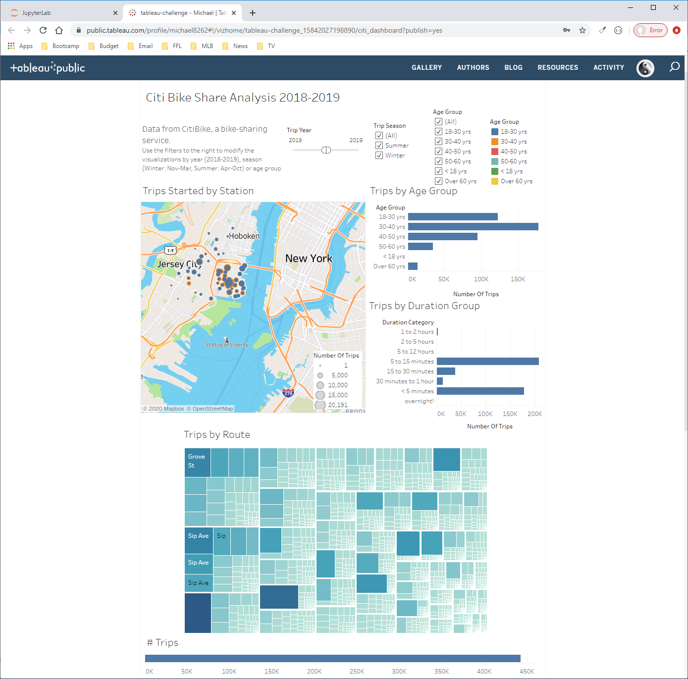

# tableau-challenge
## by Michael Dowlin
## 3/14/20

### Description
This project took 2 years of Citi Bike data, for an area in NJ.  The data was imported into PostgreSQL and then processed and aggregated into views.  I used Python to convert the views into data files that could be easily imported into Tableau.  Once in Tableau, the data was then joined and then the analysis performed.

### Link to Tableau Dashbaord
[Citi-Bike Dashboard](https://public.tableau.com/profile/michael8262#!/vizhome/tableau-challenge_15842027198890/citi_dashboard?publish=yes)

### Steps to Create
|Step #|            |                                                                                                           |
|---|------------|-----------------------------------------------------------------------------------------------------------|
|1  |Setup PostgreSQL DB|Create a database called citbike_db|
|2  |Run sql script "staging_table.sql"|Run the script to create the staging table that will be used by the notebook|
|3  |Download desired citi-files into raw data folder|Download as many citi-bike files that you would like to analyze.  Note that the import notebook has only been tested from 2018-2020.|
|4  |Run the first 4 steps of the notebook "import_data"|This will loop through all of the files in the raw data folder, importing them to the staging table.|
|5  |Run the "transform_data.sql" script|This will create the fact/dimension tables, populate them and create views that will be used by the dashboard.|
|6  |Run the rest of the notebook "import_data"|Run the rest of the steps to create the clean data files.|
|7  |Import files to Tableau and explore!|

### Contents
| File                        | Description                                                                                     |
|-----------------------------|-------------------------------------------------------------------------------------------------|
|assets\clean_data\bike_trips.csv|This file has trips aggregated by bike id, as well as trip duration and time of year (month/year)|
|assets\clean_data\station_list.csv|This file is at the station level (1 row per station), and contains the name and lat/long.  This will be joined to the other dataset for analysis inside of Tableau.|
|assets\clean_data\trips_by_station_ageGroup_duration_month.csv|The main file for analysis!  This has 2 years of citi-bike data, but aggregated to about 1/4 of the size.  I chose dimensions and binning that I thought would be interesting (i.e. instead of Age, create age buckets.|
|assets\images\*|Screenshots of the various dashboards and story-panes.|
|assets\raw_data\*.csv|All of the monthly files downloaded from the Citi bike website (25 total for this analsysis)|
|notebooks\import_data.ipynb|Jupyter notebook that will loop through the raw data folder and import the data into PostgreSQL.  It will then pull from that data (after processing), and create clean data files for the dashbaord to use in Tableau.|
|sql\staging_table.sql|This will create the staging table in the PostgreSQL database that the notebook will write to.|
|sql\transform_data.sql|This script creates the fact and dimension tables, then populates them.  The script also creates views, that will be pulled by the notebook to create the clean data files for analysis.|
